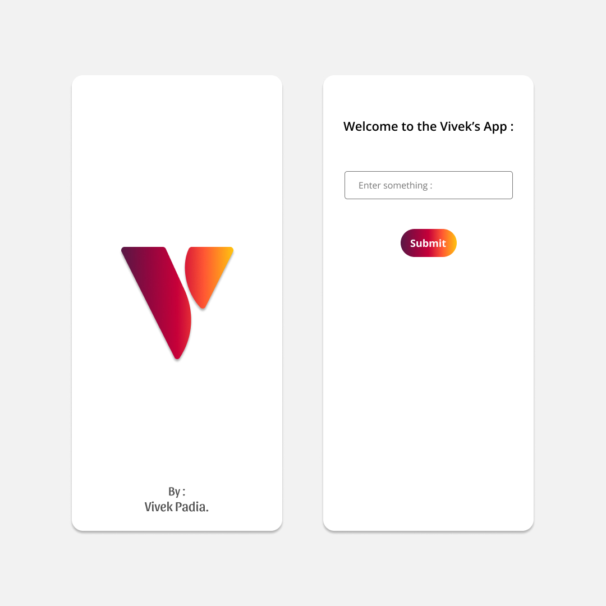

# Vivek's App

Here I have made an app using **Java**. 

It is a *Vivek's App* where the user will give their data and will get their data and show the **_Data_** 

1. You need to install Android Studion from [here](https://www.python.org/downloads/)
3. And the total Requirements is full filled.

### Important Instructions :

* The User has to give some data.

Reference Code : 
```python
btn.setOnClickListener(new View.OnClickListener() {
	@Override
	public void onClick(View view) {
		String s = txt.getText().toString();
                if (!validateData()) {
                    return;
                }
                txtv.setText("You have entered : '" + s + "'");
	}
});
```

Reference Images : <br>
	<br>

This is the README file for Vivek's App repository. [^1]

[^1]: By : Vivek Padia.
